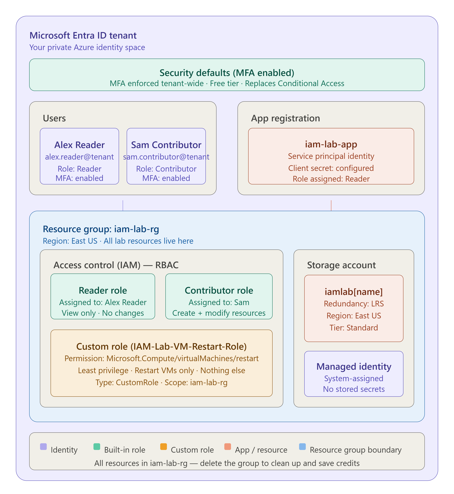
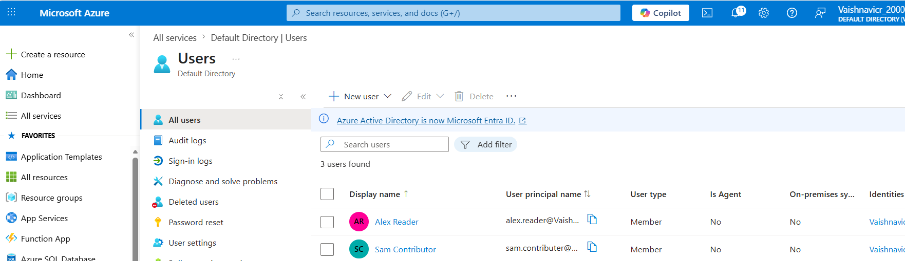
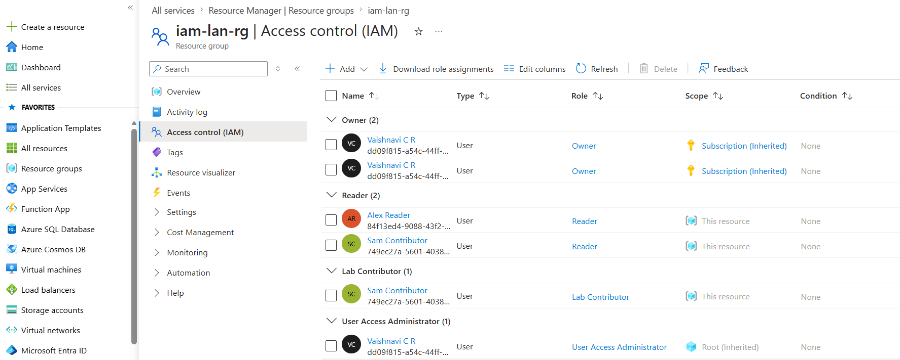
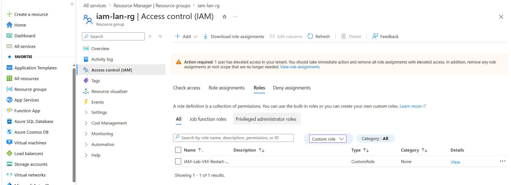
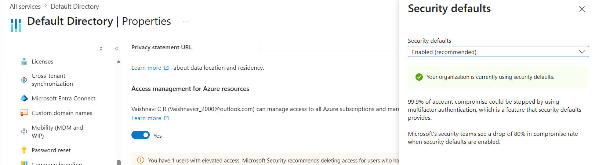
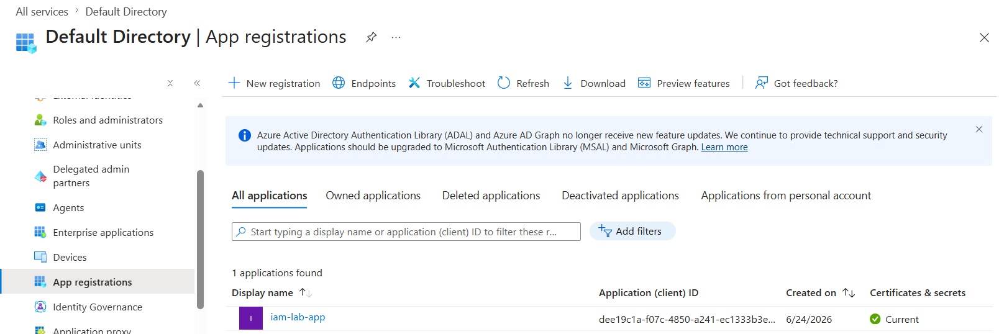

# Enterprise IAM Lab on Microsoft Azure

> A hands-on Identity and Access Management (IAM) lab built on Microsoft Azure, demonstrating enterprise-grade access control, least-privilege design, and identity lifecycle management using Microsoft Entra ID.

---

## Architecture Overview



---

## Tech Stack

| Tool | Purpose |
|---|---|
| Microsoft Entra ID | Identity provider and user management |
| Azure RBAC | Role-based access control |
| Security Defaults | Tenant-wide MFA enforcement |
| App Registration | Service principal / non-human identity |
| Azure Managed Identity | Secretless app authentication |
| Azure Storage Account | Target resource for access demonstration |
| Azure Resource Groups | Resource isolation and lifecycle management |

---

## Project Structure

```
azure-iam-lab/
└── screenshots/
    ├── 01-users.png
    ├── 02-rbac.png
    ├── 03-custom-role.png
    ├── 04-mfa-security-defaults.png
    ├── 05-app-registration.png
    └── 06-architecture.png
```

---

## Lab Phases

### Phase 1 — Account Setup and User Management

Created the foundational identity structure for the lab.

- Created Resource Group `iam-lab-rg` scoped to East US
- Created two test users in Microsoft Entra ID
  - `Alex Reader` — read-only user
  - `Sam Contributor` — write-access user
- Enforced MFA for all users via Security Defaults



---

### Phase 2 — Role-Based Access Control (RBAC)

Configured tiered access control across three role types.

- Assigned built-in **Reader** role to Alex Reader
  - Can view all resources, cannot modify anything
- Assigned built-in **Contributor** role to Sam Contributor
  - Can create and modify resources, cannot manage access
- Created custom role **IAM-Lab-VM-Restart-Role**
  - Single permission: `Microsoft.Compute/virtualMachines/restart`
  - Demonstrates least-privilege principle at the action level





---

### Phase 3 — Multi-Factor Authentication (MFA)

Enforced strong authentication across the entire tenant.

- Enabled **Microsoft Entra Security Defaults** for free tier MFA
- MFA required at every sign-in for all users
- Documented Conditional Access as the enterprise upgrade path
  - Requires Entra ID P1 license
  - Allows condition-based MFA such as enforcing only from unknown locations



---

### Phase 4 — Service Principal and Managed Identity

Implemented non-human identities following zero-trust principles.

- Registered application `iam-lab-app` in Microsoft Entra ID
- Created client secret for service principal authentication
- Assigned **Reader** role to service principal — least privilege only
- Configured **System-Assigned Managed Identity** on Azure Storage Account
  - Azure auto-manages credentials with no stored secrets
  - Eliminates risk of credential exposure or rotation failure



---

## Key Security Concepts Demonstrated

| Concept | How It Was Applied |
|---|---|
| Least privilege | Custom role restricted to single VM restart action |
| MFA enforcement | Security Defaults applied tenant-wide for free |
| Non-human identity | Service principal with scoped Reader access only |
| Secretless auth | System-assigned Managed Identity on storage account |
| Resource isolation | All resources scoped to single resource group |
| Role separation | Reader vs Contributor vs Custom role tiers |

---

## What I Learned

- How Azure RBAC enforces access at the resource group scope
- Difference between built-in roles and custom least-privilege roles
- How service principals authenticate applications without human credentials
- Why Managed Identity is more secure than stored client secrets
- How Security Defaults and Conditional Access serve different organization sizes
